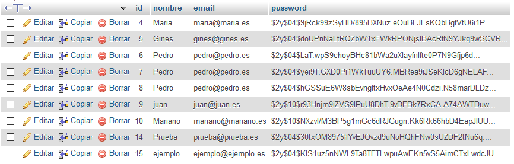

# Login con PHP y SQL

Ejemplo básico para la aplicación de tareas de registro/acceso mediante la recogida de datos por un formulario, su introducción en una base de datos en SQL y su procesamiento con PHP. Se trata de un ejemplo básico, de estudio, creado con la menor cantidad de líneas de código, para facilitar su inclusión en cualquier proyecto, siendo esta la base de su funcionamiento.

### Gestión de base de datos en SQL

Se ha creado para ello una tabla en SQL para gestionar el registro de usuarios, la tabla está compuesta por:

id | Nombre | Email | Password
-- | ------ | ----- | --------
1 | Prueba | prueba@prueba.es | ****

Siendo el campo "id" de tipo incremental. Las contraseñas se almacenan en la base de datos mediante un cifrado por cuatro pasos. El aspecto que presentan en el servidor es el siguiente:



#### Proceso de Registro

El proceso de registro es sencillo, pidiéndole al usuario únicamente **Nombre**, **Correo** y **Contraseña**. Se puede ver un ejemplo del mismo en el gif inferior.

#### Proceso de Acceso

Una vez realizado el registro, el proceso de acceso es el mismo.

#### Errores de acceso y registro

También se han tenido en cuenta diversos errores a la hora de acceder y registrarse.

#### Uso de sesiones

Gracias al uso de sesiones, el usuario puede navegar por la web y que su sesión permanezca abierta. El siguiente código muestra que se almacena en *id_usuario*.

```
$_SESSION['id_usuario'] = $usuario;
header('Location: index.php');
```

Posteriormente se puede cerrar la sesión por medio del botón *Cerrar sesión*, el cual redirige a un archivo *logout.php* donde se destruye la sesión y se redirige al usuario a la página principal.

#### Ejemplo de uso

A continuación se puede ver un ejemplo de uso de la web. Se ha hecho un recorrido desde el registro, acceso (con error), navegación por la web así como el cierre de sesión o la persistencia de las sesiones mientras se navega por la web.

